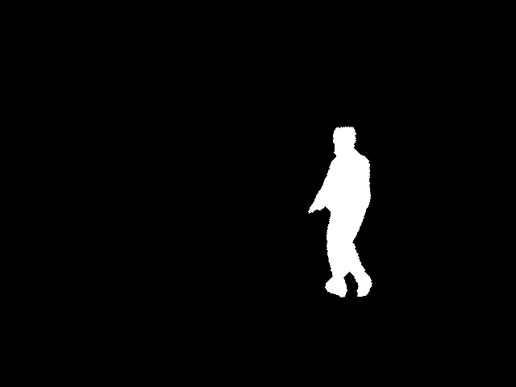
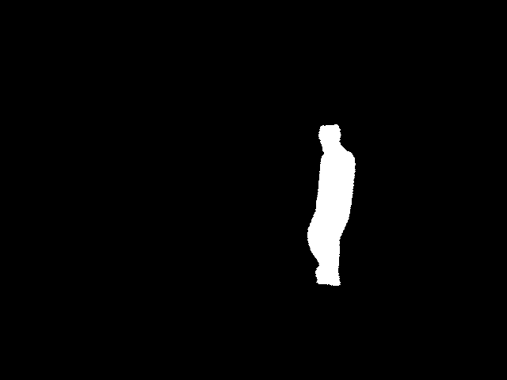
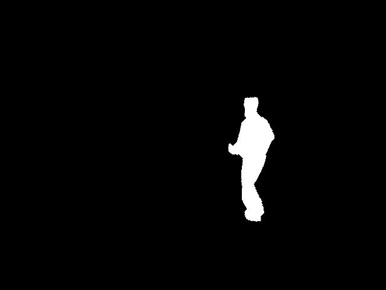
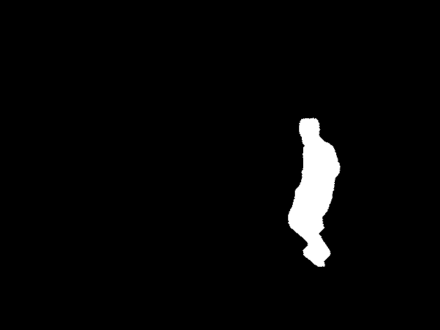

# NRIPS-run Gait dataset: Running Gait Biometrics at A Distance
Running Gait Biometrics at A Distance: A Novel Silhouette/3D Running Gait Dataset and Its Evaluation on Forensic Scenarios

## Highlights
1. A novel multi-view and multi speed-mode (walking and running) silhouette/3D gait dataset processed from the treadmill silhouette sequences at four speed conditions (approximately 3, 5, 7, 9 km/h) is created.
2. It includes processed sequences of silhouettes from 3D human mesh data for 53 identities so as to be used for study on running gait recognition.

## Obtain NRIPS-run Gait dataset
To obtain and use this dataset, all users are required to complete at least the two following steps:
1. Send us a request to imoto@nrips.go.jp for the release agreement of the dataset.
2. If you only require the pre-treated (rendered) silhouette dataset, you may only need to submit the release agreement. However, if you need the full dataset including 3D volume data, basically, a collaborative research agreement* with us is required.

*Note that a collaborative research will be processed for at least 3-5 months, after we receive a collaborative research proposal.

## License Highlights
1. **[IMPORTANT]**  ACADEMIC PURPOSES only!
2. You cannot share the data even in the same group.  Of course, sharing to third parties is strictly prohibited.
3. Seeking out personally identifiable information associated with the dataset is also strictly prohibited.
4. **[IMPORTANT]**  You need to delete all the data including copied data after two years have passed from the approval.  You have to resubmit the agreement for using the data for more periods.  (Submitting the agreement is necessary for every two years.)

## Tested code
Data in the repository are based on the OpenGait platform.
- [OpenGait platform](https://github.com/ShiqiYu/OpenGait)

Short usage instructions of training and testing by using NRIPS-run Gait Dataset are described below.

## Corresponding Author
- [Daisuke Imoto (井元大輔)](https://orcid.org/0000-0002-7419-5491)

## Citation
Please cite the following paper if you find this useful in your research:
- D. Imoto et al., "Running Gait Biometrics at a Distance: A Novel Silhouette/3D Running Gait Dataset in Forensic Scenarios," In Proc. of BIOSIG2024, 2024

## **Note**
This code is only used for **ACADEMIC PURPOSES**, anyone cannot use this dataset for anything that might be considered commercial use.

## Short usage instruction
First, you need to build a python environment in advance according to the OpenGait platform.  You can then copy and replace the files in the folders in this repository, and try training and test for each method with the commands below.  The order of the methods in the commands below are GaitSet, GaitPart, GaitGL, GaitBase, DeepGaitV2, and GaitGLR(ours), respectively.
### Training (the same speed comparison of the normal speed: 5 km/m & the three different speed comparisons with the normal speed: 5 km/h)
CUDA_VISIBLE_DEVICES=0,1,2,3 python -m torch.distributed.launch --nproc_per_node=4 opengait/main.py --cfgs ./configs/gaitset/gaitset_NRIPSrun.yaml --phase train

CUDA_VISIBLE_DEVICES=0,1,2,3 python -m torch.distributed.launch --nproc_per_node=4 opengait/main.py --cfgs ./configs/gaitpart/gaitpart_NRIPSrun.yaml --phase train

CUDA_VISIBLE_DEVICES=0,1,2,3 python -m torch.distributed.launch --nproc_per_node=4 opengait/main.py --cfgs ./configs/gaitgl/gaitgl_NRIPSrun.yaml --phase train

CUDA_VISIBLE_DEVICES=0,1,2,3 python -m torch.distributed.launch --nproc_per_node=4 opengait/main.py --cfgs ./configs/baseline/baseline_NRIPSrun.yaml --phase train

CUDA_VISIBLE_DEVICES=0,1,2,3 python -m torch.distributed.launch --nproc_per_node=4 opengait/main.py --cfgs ./configs/deepgaitv2/DeepGaitV2_NRIPSrun.yaml --phase train

CUDA_VISIBLE_DEVICES=0,1,2,3 python -m torch.distributed.launch --nproc_per_node=4 opengait/main.py --cfgs ./configs/gaitglr/gaitglr_NRIPSrun.yaml --phase train
### Test (the three same speed comparisons other than the normal speed: 5 km/h)
#### 3 km/h v.s. 3 km/h
CUDA_VISIBLE_DEVICES=0,1,2,3 python -m torch.distributed.launch --nproc_per_node=4 opengait/main.py --cfgs ./configs/gaitset/gaitset_NRIPSruntest3km.yaml --phase test
CUDA_VISIBLE_DEVICES=0,1,2,3 python -m torch.distributed.launch --nproc_per_node=4 opengait/main.py --cfgs ./configs/gaitpart/gaitpart_NRIPSruntest3km.yaml --phase test
CUDA_VISIBLE_DEVICES=0,1,2,3 python -m torch.distributed.launch --nproc_per_node=4 opengait/main.py --cfgs ./configs/gaitgl/gaitgl_NRIPSruntest3km.yaml --phase test
CUDA_VISIBLE_DEVICES=0,1,2,3 python -m torch.distributed.launch --nproc_per_node=4 opengait/main.py --cfgs ./configs/baseline/baseline_NRIPSruntest3km.yaml --phase test
CUDA_VISIBLE_DEVICES=0,1,2,3 python -m torch.distributed.launch --nproc_per_node=4 opengait/main.py --cfgs ./configs/deepgaitv2/DeepGaitV2_NRIPSruntest3km.yaml --phase test
CUDA_VISIBLE_DEVICES=0,1,2,3 python -m torch.distributed.launch --nproc_per_node=4 opengait/main.py --cfgs ./configs/gaitglr/gaitglr_NRIPSruntest3km.yaml --phase test
#### 7 km/h v.s. 7 km/h
CUDA_VISIBLE_DEVICES=0,1,2,3 python -m torch.distributed.launch --nproc_per_node=4 opengait/main.py --cfgs ./configs/gaitset/gaitset_NRIPSruntest7km.yaml --phase test
CUDA_VISIBLE_DEVICES=0,1,2,3 python -m torch.distributed.launch --nproc_per_node=4 opengait/main.py --cfgs ./configs/gaitpart/gaitpart_NRIPSruntest7km.yaml --phase test
CUDA_VISIBLE_DEVICES=0,1,2,3 python -m torch.distributed.launch --nproc_per_node=4 opengait/main.py --cfgs ./configs/gaitgl/gaitgl_NRIPSruntest7km.yaml --phase test
CUDA_VISIBLE_DEVICES=0,1,2,3 python -m torch.distributed.launch --nproc_per_node=4 opengait/main.py --cfgs ./configs/baseline/baseline_NRIPSruntest7km.yaml --phase test
CUDA_VISIBLE_DEVICES=0,1,2,3 python -m torch.distributed.launch --nproc_per_node=4 opengait/main.py --cfgs ./configs/deepgaitv2/DeepGaitV2_NRIPSruntest7km.yaml --phase test
CUDA_VISIBLE_DEVICES=0,1,2,3 python -m torch.distributed.launch --nproc_per_node=4 opengait/main.py --cfgs ./configs/gaitglr/gaitglr_NRIPSruntest7km.yaml --phase test
#### 9 km/h v.s. 9 km/h
CUDA_VISIBLE_DEVICES=0,1,2,3 python -m torch.distributed.launch --nproc_per_node=4 opengait/main.py --cfgs ./configs/gaitset/gaitset_NRIPSruntest9km.yaml --phase test
CUDA_VISIBLE_DEVICES=0,1,2,3 python -m torch.distributed.launch --nproc_per_node=4 opengait/main.py --cfgs ./configs/gaitpart/gaitpart_NRIPSruntest9km.yaml --phase test
CUDA_VISIBLE_DEVICES=0,1,2,3 python -m torch.distributed.launch --nproc_per_node=4 opengait/main.py --cfgs ./configs/gaitgl/gaitgl_NRIPSruntest9km.yaml --phase test
CUDA_VISIBLE_DEVICES=0,1,2,3 python -m torch.distributed.launch --nproc_per_node=4 opengait/main.py --cfgs ./configs/baseline/baseline_NRIPSruntest9km.yaml --phase test
CUDA_VISIBLE_DEVICES=0,1,2,3 python -m torch.distributed.launch --nproc_per_node=4 opengait/main.py --cfgs ./configs/deepgaitv2/DeepGaitV2_NRIPSruntest9km.yaml --phase test
CUDA_VISIBLE_DEVICES=0,1,2,3 python -m torch.distributed.launch --nproc_per_node=4 opengait/main.py --cfgs ./configs/gaitglr/gaitglr_NRIPSruntest9km.yaml --phase test
